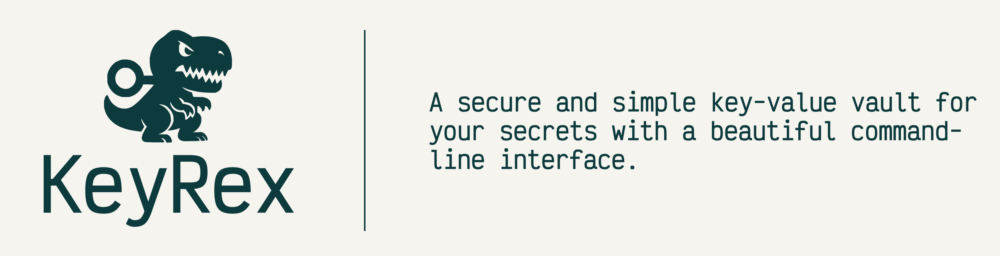

# KeyRex – Secure Local Key-Value Vault in Rust
**KeyRex** is a secure, lightweight key–value vault for managing sensitive information locally written in Rust.
It combines robust encryption, clear operational feedback, and a polished command-line interface to make secret management simple yet reliable.

[](./LICENSE)
[](https://www.rust-lang.org)
[](https://github.com/spinualexandru/keyrex/actions/workflows/ci.yml)

---

## Features

*  **Secure Local Storage** — Secrets are stored locally in `~/.keyrex/vault.dat`, never leaving your system.
*  **AES-256 Encryption** — Optional password-protected encryption with industry-standard algorithms.
*  **Elegant CLI** — A clean, color-coded interface designed for usability and clarity.
*  **Search & Filter** — Quickly locate entries with pattern-based search.
*  **Vault Analytics** — Track creation, update, and access timestamps.
*  **Safety Mechanisms** — Built-in confirmation for destructive operations and duplicate prevention.
*  **High Performance** — Written in Rust for maximum speed and minimal overhead.

---

## Installation

### From Source (Recommended)

```bash
cargo install --path . --bin keyrex
```

This installs an executable named `keyrex` into your Cargo binary directory.
Ensure this directory is included in your system `PATH`.

### From Precompiled Binaries
Download the latest release for your platform from the Releases page. <TODO: add link>

---

## Shell Completions

KeyRex provides intelligent shell completions that auto-complete real vault keys.

### Fish

A completion script is automatically generated at `~/.config/fish/completions/keyrex.fish`.
Reload your shell or run:

```bash
source ~/.config/fish/completions/keyrex.fish
```

Example:

```bash
keyrex get oll<TAB>  # auto-completes to 'keyrex get ollama'
```

### Bash

Add the following to your `~/.bashrc`:

```bash
source /path/to/keyrex/completions/keyrex.bash
```

Or install globally:

```bash
sudo cp completions/keyrex.bash /etc/bash_completion.d/keyrex
```

Reload your shell or run `source ~/.bashrc`.

### Other Shells

Generate completions manually:

```bash
keyrex completions <shell>
```

Available shells: `bash`, `fish`, `zsh`, `powershell`, `elvish`

---

## Usage

### Basic Commands

| Command                       | Description                         |
| ----------------------------- | ----------------------------------- |
| `keyrex add <key> <value>`    | Add a new entry                     |
| `keyrex get <key>`            | Retrieve a stored value             |
| `keyrex update <key> <value>` | Update an existing entry            |
| `keyrex remove <key>`         | Remove an entry (with confirmation) |

Additional flags:

* `--yes` / `-y`: Skip confirmation
* `--copy` / `-c`: Copy value to clipboard (secure - value won't be printed to stdout)

---

### Listing and Searching

```bash
keyrex list                # Show all keys
keyrex list --values       # Show keys and values
keyrex list --sort         # Sort alphabetically
keyrex search <pattern>    # Search entries
keyrex search <pattern> --values  # Include values in results
```

---

### Vault Management

```bash
keyrex info       # Display vault metadata
keyrex clear      # Remove all entries (confirmation required)
```

---

### Encryption

Enable or disable encryption:

```bash
keyrex encrypt    # Prompts for password setup
keyrex decrypt    # Disables encryption
```

* Encrypted vaults automatically prompt for a password when accessed.
* The password is cached for the session to avoid repeated prompts.
* Encryption uses **AES-256-GCM** with **PBKDF2-HMAC-SHA256** key derivation (600,000 iterations).
* Incorrect passwords trigger a clear and non-ambiguous error message.

---

## Example Workflow

```bash
# Add a secret
$ keyrex add github_token ghp_xxxxxxxxxxxx
✓ Added entry 'github_token'

# List keys alphabetically
$ keyrex list --sort
Vault entries (3):
  api_key
  database_password
  github_token

# Search for a specific key
$ keyrex search github --values
Found 1 matching entries:
  github_token: ghp_xxxxxxxxxxxx

# Retrieve a value securely (copy to clipboard without printing)
$ keyrex get github_token --copy
✓ Value copied to clipboard

# View vault information
$ keyrex info
Vault Information
  Location: /home/alex/.keyrex/vault.dat
  Entries: 3
  Created: 2025-10-30 22:02:34 UTC
  Last Updated: 2025-10-30 22:11:40 UTC
  Last Accessed: 2025-10-30 22:11:40 UTC
```

---

## Safety Features

* **Duplicate Protection** — Prevents accidental overwrites.
* **Destructive Action Confirmation** — Prompts before executing `remove` or `clear`.
* **Comprehensive Error Handling** — Human-readable error output for all failure states.
* **Exit Codes** — Standardized return codes for scripting (0 = success, 1 = error).

---

## Command Reference

| Command                | Description               | Options                                                             |
| ---------------------- | ------------------------- | ------------------------------------------------------------------- |
| `add <key> <value>`    | Add a new entry           | —                                                                   |
| `get <key>`            | Retrieve an entry         | `--copy, -c`: Copy to clipboard                                     |
| `update <key> <value>` | Update an entry           | —                                                                   |
| `remove <key>`         | Delete an entry           | `--yes, -y`: Skip confirmation                                      |
| `list`                 | List entries              | `--values, -v`: Include values<br>`--sort, -s`: Sort alphabetically |
| `search <pattern>`     | Search keys or values     | `--values, -v`: Include values                                      |
| `info`                 | Show vault metadata       | —                                                                   |
| `clear`                | Clear all entries         | `--yes, -y`: Skip confirmation                                      |
| `encrypt`              | Enable AES-256 encryption | —                                                                   |
| `decrypt`              | Disable encryption        | —                                                                   |

---

## Project Structure

```
src/
├── main.rs             # Application entry point with structured logging
├── cli.rs              # CLI argument definitions
├── vault.rs            # Data model and persistence layer
├── crypto.rs           # AES-256-GCM encryption implementation
├── config.rs           # Multi-platform configuration management
├── security.rs         # Security validation utilities
├── session.rs          # Session password management
├── output.rs           # Terminal output utilities
├── logging.rs          # Structured logging with tracing
├── completions.rs      # Shell completion generation
└── commands/           # Command handlers
    ├── mod.rs          # Command router
    ├── crud.rs         # Add, Get, Update, Remove handlers
    ├── query.rs        # List, Search, Info, Keys handlers
    ├── security.rs     # Encrypt, Decrypt handlers
    └── meta.rs         # Clear handler
```

For more details, see **CLAUDE.md**.

---

## Technical Overview

* **Storage Format:** JSON (or base64-encoded encrypted data) via `serde`.
* **Default Location:** `~/.keyrex/vault.dat` (configurable via config file)
* **Configuration:** Multi-platform config file support with environment variable expansion
* **Encryption:** AES-256-GCM with PBKDF2-HMAC-SHA256 key derivation (600k iterations).
* **Clipboard:** Cross-platform clipboard support via [arboard](https://crates.io/crates/arboard) (Linux X11/Wayland, macOS, Windows).
* **Timestamps:** Tracks creation, modification, and last access (UTC).
* **CLI Framework:** [Clap](https://crates.io/crates/clap) for argument parsing.
* **Color Output:** [Colored](https://crates.io/crates/colored) for consistent terminal styling.
* **Logging:** Structured logging with [tracing](https://crates.io/crates/tracing) (configurable via `RUST_LOG`).
* **Security:** File permission validation, atomic file writes, secure memory handling.
* **Architecture:** Modular, maintainable, and fully separated by concern.
* **Testing:** Comprehensive test isolation - all tests use temporary directories.

---

## Roadmap

* Random password generation
* Multi-vault management
* Import/export support
* Backup and sync capabilities
*  Biometric authentication
* GPG integration for hybrid encryption
* Cloud sync support (e.g., Dropbox, Google Drive)
* Sync Manager integration (e.g., Bitwarden, 1Password)

---

## Future Improvements

* **Cross-Platform Testing** — Full CI test coverage for macOS and Windows (currently limited to Ubuntu to minimize CI usage)
* **Windows Support** — Complete Windows platform support with comprehensive testing
* **macOS Testing** — Expanded macOS test coverage in CI pipeline

---

## 🤝 Contributing

Contributions, ideas, and feedback are always welcome!
If you’d like to improve KeyRex, fix a bug, or suggest a new feature, please see the full guidelines here:

👉 [**Read the Contribution Guide**](./CONTRIBUTING.md)

---

## 🧩 Acknowledgements

The following crates power KeyRex's core functionality:

**Security & Encryption:**
* [`aes-gcm`](https://crates.io/crates/aes-gcm) — AES-256-GCM authenticated encryption.
* [`pbkdf2`](https://crates.io/crates/pbkdf2) — Password-based key derivation using HMAC-SHA256.
* [`sha2`](https://crates.io/crates/sha2) — Secure hash functions used in PBKDF2.
* [`zeroize`](https://crates.io/crates/zeroize) — Secure memory zeroization to protect key material.
* [`rand`](https://crates.io/crates/rand) — Cryptographically secure random number generation.
* [`rpassword`](https://crates.io/crates/rpassword) — Safe password input for the CLI.

**CLI & Output:**
* [`clap`](https://crates.io/crates/clap) — Command-line argument parsing and help generation.
* [`clap_complete`](https://crates.io/crates/clap_complete) — Dynamic shell completions for `bash`, `fish`, `zsh`, etc.
* [`colored`](https://crates.io/crates/colored) — Rich, colorized terminal output.
* [`arboard`](https://crates.io/crates/arboard) — Cross-platform clipboard support.

**Logging & Observability:**
* [`tracing`](https://crates.io/crates/tracing) — Structured logging framework.
* [`tracing-subscriber`](https://crates.io/crates/tracing-subscriber) — Tracing output formatting and filtering.

**Configuration & Data:**
* [`serde`](https://crates.io/crates/serde) & [`serde_json`](https://crates.io/crates/serde_json) — Data serialization and vault persistence.
* [`toml`](https://crates.io/crates/toml) — TOML configuration file parsing.
* [`shellexpand`](https://crates.io/crates/shellexpand) — Environment variable expansion in config paths.
* [`chrono`](https://crates.io/crates/chrono) — Timestamp management with `serde` integration.
* [`dirs`](https://crates.io/crates/dirs) — Cross-platform handling of user directories.
* [`base64`](https://crates.io/crates/base64) — Encoding for encrypted vault entries.
* [`fslock`](https://crates.io/crates/fslock) — File locking for concurrent access safety.
* [`thiserror`](https://crates.io/crates/thiserror) — Custom error type definitions.
